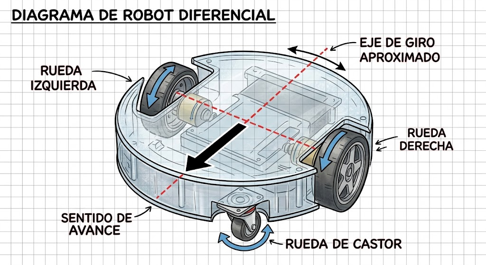

# Guía Completa de Cinemática y Configuraciones de Ruedas en Robots Móviles

---

## 1. Conceptos básicos

### ¿Qué es un robot móvil?
Un robot móvil es un sistema automatizado capaz de desplazarse de manera autónoma o teleoperada a través de su entorno físico. Para lograr esto, utiliza un sistema de locomoción (como ruedas, orugas o patas), respaldado por sensores para percibir su entorno y un sistema de procesamiento que toma decisiones sobre su trayectoria.

### ¿Qué diferencia existe entre un robot móvil y un robot manipulador fijo?
La principal diferencia radica en su espacio de trabajo y base de operación:
* **Robot manipulador fijo:** Está anclado a una superficie estática (como los brazos robóticos industriales). Su área de acción está estrictamente limitada por el alcance físico de sus articulaciones.
* **Robot móvil:** No tiene una base fija. Puede trasladarse libremente por el entorno, lo que expande de manera ilimitada su radio de operación.

### ¿Qué función cumple el sistema de locomoción de un robot?
El sistema de locomoción es el mecanismo encarga de transformar la energía eléctrica o mecánica en movimiento físico contra el suelo. Su función principal es permitir el desplazamiento controlado del robot, determinando sus grados de libertad, su velocidad, su capacidad de carga y el tipo de terreno por el que puede transitar.

### ¿Qué significa que un robot tenga movilidad omnidireccional?
Significa que el robot tiene la capacidad de desplazarse instantáneamente en cualquier dirección del plano cartesiano ($X, Y$) de manera independiente a la orientación de su chasis. Es decir, puede moverse hacia adelante, hacia atrás, de lado a lado o en diagonal, así como girar sobre su propio eje sin necesidad de realizar maniobras previas de reorientación.

### ¿Qué relación existe entre la disposición de las ruedas y los movimientos que puede realizar el robot?
La posición, orientación y tipo de ruedas imponen restricciones cinemáticas sobre el vehículo. Las ruedas convencionales solo permiten movimiento en la dirección de su plano de rotación, restringiendo los desplazamientos laterales directos. En cambio, disponer ruedas en ángulos específicos o utilizar ruedas especiales (como Omni o Mecanum) permite vectorizar las fuerzas y lograr movimientos multidireccionales.

### Ejemplos de uso de robots móviles
* **Industria y logística:** Robots AMR (Autonomous Mobile Robots) y AGV (Automated Guided Vehicles) para mover mercancías y tarimas en almacenes (ej. Amazon Robotics).
* **Exploración espacial y de terrenos peligrosos:** Rovers planetarios (como el Perseverance en Marte) y robots de inspección volcánica o alcantarillado.
* **Servicios y hogar:** Aspiradoras autónomas de uso doméstico y robots de entrega de comida en áreas urbanas o universitarias.
* **Medicina:** Robots móviles para desinfección con luz UV en quirófanos y transporte de muestras biológicas en hospitales.

---

## 2. Robot diferencial con rueda de castor

El sistema de tracción diferencial es uno de los más utilizados en la robótica móvil por su simplicidad. Consiste en dos ruedas motrices instaladas sobre un mismo eje transversal, impulsadas por motores independientes, y acompañadas por una o más ruedas locas ("castor") para estabilidad.


### Descripción del funcionamiento
* **Colocación de las ruedas motrices:** Se ubican simétricamente a los lados izquierdo y derecho del centro de masa del robot, montadas sobre un mismo eje hipotético.
* **Función de la rueda de castor:** Es una rueda libre (sin motor) que gira 360° sobre un eje vertical de pivote. Su única función es brindar un punto de apoyo para mantener el equilibrio del chasis sin oponer resistencia a los giros.
* **Avance en línea recta:** Ambas ruedas motrices giran hacia adelante exactamente a la misma velocidad angular.
* **Giro hacia la izquierda o derecha:** Se logra haciendo girar una rueda a mayor velocidad que la otra. El robot curva su trayectoria alejándose de la rueda más rápida.
* **Giro con una rueda detenida:** Si la rueda izquierda se detiene y la derecha avanza, el robot realiza un giro en arco pivotando directamente sobre la rueda izquierda.
* **Giro sobre su propio eje:** Si la rueda izquierda retrocede y la rueda derecha avanza a la misma velocidad, el robot rota sobre su centro geométrico sin trasladarse.
* **Ventajas:** Mecánica sencilla, bajo costo, algoritmos de control simples y radio de giro nulo (puede girar sobre sí mismo).
* **Limitaciones:** Sensible a imperfecciones del terreno, propenso al deslizamiento (error acumulativo en odometría) e imposibilidad de moverse lateralmente.
* **Aplicaciones:** Aspiradoras robóticas, robots educativos (como LEGO Mindstorms, Arduino Turtle bots) y plataformas de servicio en interiores.

### Comportamiento del robot diferencial según el giro de las ruedas

| Rueda izquierda | Rueda derecha | Movimiento del robot |
| :--- | :--- | :--- |
| Avanza | Avanza | Avanza en línea recta |
| Detenida | Avanza | Gira a la izquierda (pivota sobre rueda izquierda) |
| Avanza | Detenida | Gira a la derecha (pivota sobre rueda derecha) |
| Avanza | Retrocede | Giro sobre su propio eje hacia la izquierda |
| Retrocede | Avanza | Giro sobre su propio eje hacia la derecha |
| Retrocede | Retrocede | Retrocede en línea recta |

---

## 3. Robots omnidireccionales con ruedas Omni

### Funcionamiento de una rueda Omni
* **Construcción:** Consiste en un cuerpo de rueda principal rígido que tiene instalados varios rodillos pequeños de goma alrededor de su perímetro.
* **Función de los rodillos:** Los rodillos rotan libremente sobre ejes que son **perpendiculares** al eje de rotación de la rueda principal.
* **Generación de fuerza:** La rueda genera tracción motriz en el sentido longitudinal de su giro (accionada por el motor).
* **Deslizamiento libre:** En la dirección transversal (lateral), los rodillos giran libremente, lo que permite que la rueda se deslice sin fricción apreciable en esa dirección.
* **Ventaja cinemática:** Esta propiedad elimina el acoplamiento rígido con el suelo en el sentido lateral, permitiendo sumar vectores de movimiento de varias ruedas para lograr desplazamientos en cualquier dirección.

---

### Configuración de tres ruedas

En esta configuración, las ruedas Omni se montan a una distancia de $120^\circ$ entre sí, formando un triángulo equilátero o un chasis circular.

```
                  VISTA SUPERIOR (3 RUEDAS OMNI)

                            [ Rueda 1 ]
                              (  ^  )
                               / \
                              /   \
                             /     \
                            /       \
              [ Rueda 2 ]  /         \  [ Rueda 3 ]
               (  /  )                 (  \  )
```

* **Distribución y orientación:** Tres ruedas distribuidas simétricamente a $120^\circ$ alrededor del centro del robot, orientadas tangencialmente al perímetro del chasis.
* **Desplazamiento adelante/atrás:** La Rueda 1 permanece detenida, mientras que la Rueda 2 y la Rueda 3 giran a velocidades iguales pero en sentidos opuestos para empujar el robot longitudinalmente.
* **Desplazamiento lateral:** La Rueda 1 gira a máxima velocidad mientras las Ruedas 2 y 3 giran a media velocidad en el mismo sentido para contrarrestar sus componentes longitudinales.
* **Movimiento en diagonal:** Se logra combinando la rotación de dos ruedas mientras la tercera permanece en reposo o actúa con baja velocidad.
* **Giro sobre su propio eje:** Las tres ruedas giran en el mismo sentido angular y a la misma velocidad.
* **Diferentes velocidades:** Al variar las velocidades individuales mediante cinemática inversa, el robot puede realizar trayectorias curvas helicoidales o combinar traslación y rotación simultáneamente.

---

### Configuración de cuatro ruedas

```
                  VISTA SUPERIOR (4 RUEDAS OMNI)

                     [ Rueda 1 ]      [ Rueda 2 ]
                        ( \ )            ( / )
                           \            /
                            +----------+
                            |  Chasis  |
                            +----------+
                           /            \
                        ( / )            ( \ )
                     [ Rueda 3 ]      [ Rueda 4 ]
```

* **Colocación:** Se montan generalmente en las cuatro esquinas de un chasis cuadrado o en cruz ($90^\circ$ entre sí), inclinadas a $45^\circ$ respecto a los ejes principales del vehículo.
* **Combinación de velocidades:** Al accionar las cuatro ruedas en parejas o grupos, se descomponen vectores de fuerza ortogonales que producen movimiento en cualquier dirección deseada.
* **Diferencias respecto a 3 ruedas:** Ofrece mayor estabilidad estructural, mayor tracción y soporte de carga superior al distribuir el peso sobre cuatro puntos.
* **Ventajas y limitaciones:** 
  * *Ventajas:* Excelente maniobrabilidad, alta precisión y capacidad de carga.
  * *Limitaciones:* Requiere un motor adicional (4 motores), mayor costo, consumo energético elevado y necesidad de suspensión en terrenos irregulares para asegurar contacto constante de las cuatro ruedas.

---

## 4. Robot omnidireccional con ruedas Mecanum

### Funcionamiento de las ruedas Mecanum
* **Construcción:** Similar a una rueda Omni, pero los rodillos periféricos están montados con una inclinación de **$45^\circ$** con respecto al eje de rotación de la rueda principal.
* **Diferencia con rueda Omni:** En la rueda Omni el rodillo está a $90^\circ$, mientras que en la Mecanum está a $45^\circ$. Esto causa que al girar la rueda Mecanum, la fuerza generada contra el piso no sea puramente frontal, sino diagonal.
* **Por qué se usan cuatro ruedas:** Se requiere un arreglo simétrico de cuatro ruedas para que los vectores de fuerza en diagonal creados por cada rueda se puedan sumar o cancelar entre sí a voluntad.
* **Orientación en el chasis:** Las ruedas deben colocarse en un patrón específico donde las líneas de los rodillos formen una vista de "X" o "O" desde la parte superior. Para correcto funcionamiento, el patrón visto desde arriba debe ser en **"X"**.

```
                  PATRÓN DE RUEDAS MECANUM (VISTA SUPERIOR)

                      \ (01) /        \ (02) /
                       +--------------------+
                       |                    |
                       |       Chasis       |
                       |                    |
                       +--------------------+
                      / (03) \        / (04) \
```

### Combinación de movimientos
1. **Avance:** Las 4 ruedas giran hacia adelante a la misma velocidad. Los componentes transversales de los rodillos se cancelan entre sí y los longitudinales se suman.
2. **Retroceso:** Las 4 ruedas giran hacia atrás a la misma velocidad.
3. **Movimiento a la izquierda:** Ruedas en diagonal opuesta se mueven en sentidos contrarios (Delantera Izq atrás, Delantera Der adelante, Trasera Izq adelante, Trasera Der atrás).
4. **Movimiento a la derecha:** Inverso al movimiento a la izquierda.
5. **Movimiento diagonal:** Se activan solo dos ruedas en diagonal opuesta mientras las otras dos permanecen inmóviles.
6. **Giro sobre su propio eje:** Las ruedas del lado izquierdo giran en un sentido y las del lado derecho en el sentido contrario.

### Tabla de sentido de giro para ruedas Mecanum

| Movimiento | Delantera izquierda | Delantera derecha | Trasera izquierda | Trasera derecha |
| :--- | :---: | :---: | :---: | :---: |
| **Avanzar** | $\uparrow$ | $\uparrow$ | $\uparrow$ | $\uparrow$ |
| **Retroceder** | $\downarrow$ | $\downarrow$ | $\downarrow$ | $\downarrow$ |
| **Desplazarse a la izquierda** | $\downarrow$ | $\uparrow$ | $\uparrow$ | $\downarrow$ |
| **Desplazarse a la derecha** | $\uparrow$ | $\downarrow$ | $\downarrow$ | $\uparrow$ |
| **Girar a la izquierda** | $\downarrow$ | $\uparrow$ | $\downarrow$ | $\uparrow$ |
| **Girar a la derecha** | $\uparrow$ | $\downarrow$ | $\uparrow$ | $\downarrow$ |

*Simbología: ($\uparrow$) Giro hacia adelante | ($\downarrow$) Giro hacia atrás*

---

## 5. Robot con dirección Ackermann

La geometría de dirección Ackermann es el sistema de dirección estándar utilizado en automóviles y vehículos de transporte, diseñado para evitar que las ruedas resbalen hacia los lados durante una curva.

```
                       C-G (Centro de Giro)
                          *
                         / \
                        /   \
                       /     \
                      /       \
                     /         \
       [Rueda Interior]      [Rueda Exterior]
             ( / )                ( | )
               \                    /
                +------------------+
                |    Eje Delantero |
                |                  |
                |   Chasis Robot   |
                |                  |
                +------------------+
               [ Rueda Rear-L ]   [ Rueda Rear-R ]
                     ( | )              ( | )
```

### Características del sistema Ackermann
* **Distribución de ruedas:** Cuatro ruedas dispuestas en dos ejes (delantero y trasero).
* **Ruedas de dirección:** Las ruedas del eje delantero giran mecánicamente sobre pivotes para orientar el vehículo.
* **Ruedas de tracción:** Normalmente el eje trasero impulsa el movimiento (tracción trasera), aunque también puede ser delantera o en las cuatro ruedas (AWD).
* **Ángulos de giro en curva:** La rueda interior a la curva gira en un ángulo mayor que la rueda exterior. Esto sucede porque la rueda interior recorre una circunferencia de menor radio que la rueda exterior.
* **Radio de giro:** Es el radio del círculo mínimo que describe el vehículo al virar con la dirección en su ángulo máximo.
* **Imposibilidad de movimiento lateral:** Las ruedas fijas del eje trasero restringen cualquier deslizamiento perpendicular, obligando al vehículo a avanzar para poder cambiar de posición transversal.
* **Semejanza con automóviles:** Es conceptualmente idéntica a la dirección de un auto convencional, empleando un sistema de bieletas o servomotores orientables.
* **Ejemplos reales:** Carros de golf autónomos, camiones de carga de transporte minero autónomo (como Caterpillar Autonomous Trucks) y prototipos como el Google Firefly o plataformas de pruebas de conducción autónoma a escala.

---

## 6. Comparación de configuraciones

### Tabla comparativa

| Configuración | Número típico de ruedas | Movimiento lateral | Giro sobre su eje | Complejidad mecánica | Complejidad de control | Aplicaciones |
| :--- | :---: | :---: | :---: | :---: | :---: | :--- |
| **Diferencial + castor** | 2 motrices + 1 o 2 locas | No | Sí | Muy Baja | Baja | Aspiradoras robot, proyectos escolares. |
| **Omni de 3 ruedas** | 3 | Sí | Sí | Media | Media | Robots de competencia (Soccer RoboCup). |
| **Omni de 4 ruedas** | 4 | Sí | Sí | Media-Alta | Media | Módulos de logística y plataformas de transporte. |
| **Mecanum** | 4 | Sí | Sí | Alta | Alta | Sillas de ruedas avanzadas, AGVs industriales de almacén. |
| **Ackermann** | 4 | No | No | Alta | Media | Vehículos autónomos en carreteras, tractores agrícolas. |

### Selección de configuración por caso de uso

* **Robot pequeño para aprender programación y control:** **Diferencial + castor.** Su matemática cinemática es directa (dos variables) y su construcción física no requiere mecanismos complejos.
* **Robot para desplazarse en un almacén con espacios reducidos:** **Mecanum.** Permite maniobrar en pasillos estrechos realizando desplazamientos laterales directos sin necesidad de girar todo el volumen del robot.
* **Plataforma que necesita moverse lateralmente sin cambiar su orientación:** **Omni de 4 ruedas o Mecanum.** Ambos sistemas permiten desacoplar totalmente la orientación angular ($\theta$) de la posición en el plano ($X, Y$).
* **Vehículo autónomo que debe circular similar a un automóvil:** **Ackermann.** Permite replicar fielmente el comportamiento dinámico, la física de curvas y los algoritmos de conducción de los vehículos de pasajeros reales.
* **Robot para competencia con rápidos cambios de dirección:** **Omni de 3 ruedas.** Ofrece menor peso total, respuesta dinámica ágil y rápida aceleración vectorial en cualquier sentido.
* **Robot móvil sencillo con únicamente dos motores:** **Diferencial + castor.** Cada uno de los dos motores acciona directamente una de las ruedas motrices, dejando el apoyo posterior a la rueda loca pasiva.

---

## 7. Análisis del movimiento

### Diferencial: Giro sobre su propio eje
El giro sobre su propio eje ocurre debido al equilibrio vectorial de momentos. Cuando la rueda izquierda gira hacia adelante ($+\omega$) y la derecha hacia atrás ($-\omega$) a la misma magnitud de velocidad, la velocidad de traslación del centro de masa ($V_{cm}$) es igual a cero:

$$V_{cm} = \frac{V_{derecha} + V_{izquierda}}{2} = \frac{V + (-V)}{2} = 0$$

Dado que $V_{cm} = 0$, el robot no experimenta desplazamiento lineal en $X$ ni $Y$. Sin embargo, la diferencia de velocidades crea una velocidad angular nula ($\omega_z \neq 0$), generando una rotación pura sobre el punto medio del eje de las ruedas motrices.

### Omni: Movimiento lateral gracias a los rodillos
Los rodillos colocados pasivamente alrededor del perímetro exterior de la rueda Omni eliminan la restricción holonómica tradicional. Cuando la rueda gira por acción de su motor, transmite fuerza normal contra el piso en la dirección de su circunferencia. Sin embargo, si una fuerza perpendicular actúa sobre la rueda, los rodillos giran libremente sobre sus propios ejes sin ofrecer resistencia por fricción. Esto permite desglosar el movimiento en dos componentes ortogonales completamente independientes: la tracción activa y el deslizamiento pasivo.

### Mecanum: Movimiento lateral sin ruedas orientadas al costado
Cada rueda Mecanum tiene sus rodillos inclinados a $45^\circ$. Al girar la rueda impulsa el piso generando una fuerza con dos componentes vectoriales idénticos: uno longitudinal ($F_x$) y uno transversal ($F_y$).
Al configurar adecuadamente el giro de las cuatro ruedas (por ejemplo, Delantera Izquierda atrás, Delantera Derecha adelante, Trasera Izquierda adelante, Trasera Derecha atrás), los vectores longitudinales ($F_x$) producidos por las cuatro ruedas se cancelan mutuamente por tener direcciones opuestas ($F_x - F_x = 0$), mientras que los vectores transversales ($F_y$) de todas las ruedas apuntan exactamente en la misma dirección lateral, sumándose ($F_y + F_y + F_y + F_y = 4F_y$) y forzando al robot a deslizarse lateralmente.

### Ackermann: Necesidad de avanzar/retroceder para cambiar de posición lateral
Un sistema Ackermann está sujeto a restricciones de **no holonomía**. Las ruedas traseras están fijadas al chasis de forma paralela al eje del vehículo, lo que significa que el neumático no puede deslizarse perpendicularmente debido a la fricción estática con el pavimento. Por lo tanto, el vector de velocidad del punto de contacto neumático-suelo siempre debe ser tangente a la orientación de la rueda. La única manera de cambiar la coordenada lateral es haciendo girar las ruedas delanteras para crear un centro instantáneo de rotación (CIR) exterior y recorrer una curva mediante un desplazamiento longitudinal simultáneo.

---

## 8. Aplicación en un robot real

### Caso de estudio: KUKA YouBot

```
                  +--------------------------------+
                  |    Brazo Robótico Manipulador  |
                  +--------------------------------+
                  |       Chasis del YouBot        |
                  +--------------------------------+
                   (o)   (o)              (o)   (o)
                  Ruedas Mecanum de alta precisión
```

* **Nombre del robot:** KUKA YouBot.
* **Fabricante:** KUKA Robotics / KUKA Laboratories.
* **Tipo de locomoción:** Omnidireccional Holonómica.
* **Número y tipo de ruedas:** 4 ruedas Mecanum accionadas individualmente.
* **Sensores principales:** Encoders ópticos absolutos en cada motor, escáneres láser LiDAR de seguridad en la parte frontal y trasera, y cámaras de visión artificial de profundidad (RGB-D).
* **Actuadores:** 4 servomotores industriales de corriente continua (DC) sin escobillas con reductores planetarios integrados.
* **Aplicación:** Plataforma de investigación académica e industrial para el desarrollo de conceptos de "Manufactura Móvil Autónoma" y logística en la Industria 4.0.

### Justificación de la configuración
El uso de ruedas Mecanum es clave para el KUKA YouBot debido a que combina una plataforma móvil con un brazo manipulador robótico de precisión. En un entorno de fábrica o laboratorio, el robot necesita aproximarse a mesas de trabajo o estantes para tomar objetos. Las ruedas Mecanum le permiten alinearse milimétricamente en cualquier dirección espacial ($X,Y$) sin necesidad de realizar complejas maniobras de giro, reduciendo el área de trabajo requerida y aumentando la eficiencia temporal de las tareas operativas.

---

## Reflexión final

El estudio de los sistemas de locomoción para robótica móvil demuestra que la configuración "perfecta" no existe en términos absolutos, sino que cada diseño responde a compromisos entre flexibilidad de movimiento, complejidad de control y resistencia mecánica.

De todas las configuraciones analizadas, la **tracción diferencial** es la más sencilla de comprender e implementar, ya que su modelo cinemático se reduce a la geometría básica de círculos concéntricos y relaciones de velocidad de dos motores. Por otro lado, la rueda **Mecanum** es la que ofrece la mayor libertad de movimiento en superficies planas, permitiendo movimientos holonómicos completos sin añadir actuadores de dirección adicionales.

Para el desarrollo de un primer robot móvil personal, la configuración **diferencial con rueda de castor** es sin duda la elección más adecuada. Su simplicidad mecánica reduce los fallos de hardware, requiere motores económicos y permite enfocarse en la programación de lógica de control, evasión de obstáculos y navegación básica.

Finalmente, la razón por la cual no existe una única configuración para todos los robots radica en la diversidad de entornos y objetivos operacionales. Mientras que un almacén logístico demanda la omnidireccionalidad de las ruedas Mecanum sobre pisos lisos, un vehículo de pasajeros o de exploración espacial prioriza la estabilidad, la capacidad de carga y la tracción en terrenos irregulares que solo sistemas como Ackermann o tracciones tipo oruga pueden garantizar.

---

## Referencias

* **Siegwart, R., Nourbakhsh, I. R., & Scaramuzza, D.** (2011). *Introduction to Autonomous Mobile Robots* (2nd ed.). MIT Press.
* **Corke, P.** (2017). *Robotics, Vision and Control: Fundamental Algorithms in MATLAB* (2nd ed.). Springer. https://doi.org/10.1007/978-3-319-54413-7
* **KUKA Robotics.** (2011). *kuka-youbot.com: Mobile Manipulation for Research and Education*. Technical Specification Manual.
* **Rojas, R.** (2005). *Omnidirectional Mobile Robots*. Free University of Berlin, Department of Mathematics and Computer Science. http://www.inf.fu-berlin.de/inst/ag-ki/rojas_home/documents/tutorials/Omnidirectional.pdf
* **Lynch, K. M., & Park, F. C.** (2017). *Modern Robotics: Mechanics, Planning, and Control*. Cambridge University Press.